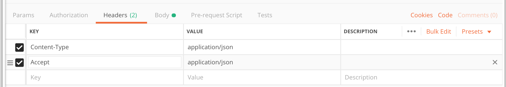
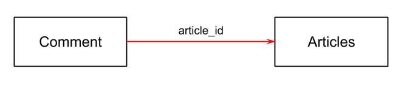
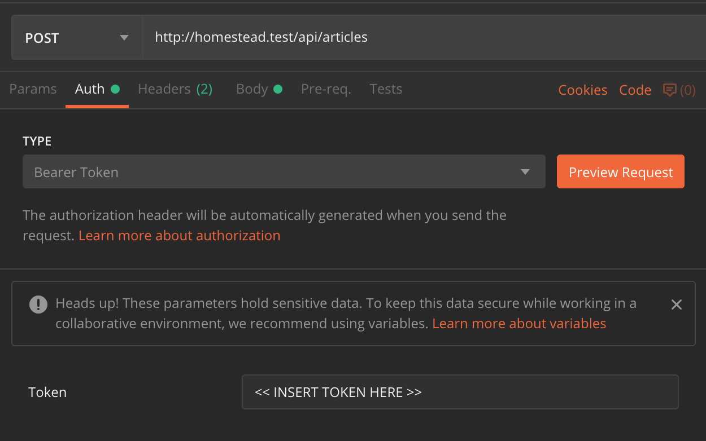

# Laravel 

* [Download Notes (PDF)](https://github.com/elev8now/CodeCheat/raw/master/docs/assets/DevelopMe_Laravel.pdf)

## Terminology

**Framework**
-  A foundation of existing code that supports the building and deployment of applications using less code 

**Variable**
- A value that is stored and can change over time

**Function**
- A piece of code that takes an argument, performs an action, and returns an output 

**Object**
- A way of storing various types of information (properties or instance methods) in key/value pairs

**Class**
- A way of encapsulating code as a template/blueprint for instantiating an Object instance, or creating reusable code

**Property**
- A variable within a Class  

**Method**
- A function within a Class

**Instance / Instantiate**
- An Object instance is an instantiated class 

**Class method**
- A method that you can call without instantiating a Class

**Instance method**
- A method that exists within an Object instance

**MVC**
- Model View Controller 
  - A **model** is where you put code that is responsible for putting data into and getting data out of the database 
  - A **view** is ...
  - A **Controller** is where you put the code that handles the HTTP request and sends the response 

**OOP**
- Object Oriented Programming - a paradigm of organising code 

**API**
- Application Programming Interface (API)
- In basic terms, APIs just allow applications to communicate with one another

**HTTP**
- Hypertext Transfer Protocol (HTTP) is essentially a well defined text format or standard that the browser is able to interpet into a web page. 
- By default, servers liten on port 80 for any request that looks like HTTP. If it receives a valid request, it sends back an HTTP response.

**HTTP Request Methods**

- GET - used to retrieve data
- POST - used to submit data
- PUT - used to edit data
- PATCH - used to edit data
- DELETE - used to delete data 

**Migration** 
- Blueprints for the database structure (tables and columns) !! it doesn't hold any content 

**Resource** 
- A type of class that allows us to control/filter the format of the JSON output when we wrap 

**Mass Assignment Vulnerability** 
- Prevents users from accessing or 'filling' data they're not authorised to access 
 
**Route Model Binding** 
- This prevents a request being fulfilled if the requested resource does not exist 

**Validation** 
- A Request Class provides rules for checking incoming data and gives back relevant error messages  

**Public** 
- A property or method that is accessible outside the Class it belongs to

**Private** 
- A property or method that is inaccessible outside of the Class it belongs to 

**Static** 
- a property or method that belongs to the Class, not the Object instance 

* * *

## Introduction

- Created by Taylor Otwell: previously a .NET developer
- A modern PHP framework
- Written using modern best practices
- Minimal core: uses Composer packages where possible
- Built on [Symfony](https://symfony.com)
- Great ecosystem

### Laravel Features

- **Homestead** Vagrant configuration
- **Eloquent ORM**
- CLI tool **artisan**
- **Database migrations**
- Scheduling
- Job Queues
- Good documentation
- Active community: [Laracasts](https://laracasts.com)
- [Laravel Forge](https://forge.laravel.com): easily host Laravel apps

* * *

## API Setup

We'll need to install the Laravel installer package:

```shell
composer global require laravel/installer
```

This will allow us to easily create new Laravel projects. You'll only need to run this once (or if you get a new computer).

* * *

## New Project

To create a new Laravel project run:

```shell
laravel new blog-api
```

**Note**: `blog-api` is just the project name, you could choose anything.

We're going to use Vagrant. Laravel has a prebuilt box called **Homestead**.

In the newly created `blog-api` directory, run:

```shell
composer require laravel/homestead --dev
```

Next, we need to setup Homestead:

```shell
vendor/bin/homestead make
```

Next, change the second line of `Homestead.yaml`:

```
memory: 512
```

Finally, we can run:

```shell
vagrant up
```

Once Vagrant has finished loading visit `http://homestead.test` (or `http://localhost:8000` in Windows)

* * *

## Routing

We're already familiar with **routing** from when we did React. The concept is very similar in Laravel: we need to take a URL and use it to determine what we want to do.

First, let's add a route to handle `POST` events sent to `/articles`. This will point to code that handles creating a new article.

Add a `POST` route for `/articles` to `routes/api.php`:

```php
// use the post method
// when the use request /articles - don't need the forward slash
// which will call the store method of the Articles controller
$router->post("articles", "Articles@store");
```

* * *

## Controllers

In Laravel routes point to **controllers**. It is the controller's job to deal with the request and return a response.

Run the following inside your Vagrant box to create an Articles controller. You will need to ssh into the vagrant box `vagrant ssh` then navigate into the code directory `cd code`:

```shell
artisan make:controller Articles --api
```

Laravel has added a `store` method to `Articles`:

```php
public function store(Request $request)
{
    // handle post request
}
```

<p class="footnote">† <i>All</i> commands should be run inside Vagrant</p>

* * *

## Database Migrations

We'll need to store the articles in a database so that the data is persisted.

Laravel makes it really easy to deal with database structuring using **database migrations**.

Database migrations are bits of code that tell the database how it should be structured. These are run by Laravel when we run the `artisan migrate` command. This means anyone with our codebase can easily get their database to have the right structure for the app.

### Creating a Model/Migration

On your Vagrant box run:

```shell
artisan make:model Article -m
```

This will create an Article model class (in `app/Article.php`) as well as a database migration (in the `database/migrations` directory).

We'll need to update the migration file to create the structure we'll need to store an article:

```php
public function up()
{
    Schema::create('articles', function (Blueprint $table) {
        $table->increments('id');
        $table->string("title", 100);
        $table->text("article");
        $table->timestamps();
    });
}
```

Finally, we need to run the migrations:

```shell
artisan migrate
```

We should now have an `articles` table in the database.

**Note**: if you make a mistake in your migration file, you can run `artisan migrate:rollback` to undo the last set of migrations that you ran.

* * *

## Models

The `Article` model **extends** the Eloquent ORM model. This allows us to use the model to interact with the data from the database.

For example, to add an article to the database we can use the `Article::create()` method. And to get all the articles out of the database we can use `Article::all()`.

Once we have an `Article` object we can access the data from the database. For example:

```php
$article->title; // would give us the article title
$article->title = "Blah blah blah"; // would set the article title
```

If you change the values of a model object, make sure you run `save()` on it:

```php
$article->save();
```

You can read more above models on the [Eloquent ORM Documentation](http://laravel.com/docs/5.6/eloquent#introduction).

* * *

## Creating

Now we've got somewhere to store the articles, we need to update our controller so that we can create an Article.

First, we need to tell the controller to use the `Article` model that we created using `artisan`:

```php
// make sure you add this near the top, undereath the namespace declaration
use App\Article;
```

Then we need to update our `store` function to create an article using the data from the request:

```php
public function store(Request $request)
{
    // get post request data for title and article
    $data = $request->only(["title", "article"]);

    // create article with data and store in DB
    $article = Article::create($data);

    // return the article along with a 201 status code
    return response($article, 201);
}
```

Now we can try doing a `POST` request with Postman.

* * *

## Mass Assignment Vulnerability

If we're not careful we might accidentally allow users to update fields that they should have access to. Laravel guards against this by default.

We can update the `Article` model to tell it which fields to expect.

```php
<?php

namespace App;

use Illuminate\Database\Eloquent\Model;

class Article extends Model
{
    // Only allow the title and article field to get updated via mass assignment
    protected $fillable = ["title", "article"];
}
```

Now try doing a `POST` request with Postman.

* * *

## Listing

Next let's setup the `GET` request to `/articles`.

First, add the route:

```php
$router->get("articles", "Articles@index");
```

And update the `index` method in the `Articles` controller:

```php
public function index()
{
    // get all the articles
    return Article::all();
}
```

That's all there is to it: Laravel does all the hard work for us once we've setup our model.

* * *

## Reading

Next we want to add a route for `GET` to something like `/articles/1`.

First, add a route:

```php
// we can group all our articles routes together
$router->group(["prefix" => "articles"], function ($router) {
    // ...previous routes...

    // {article} is a url parameter representing the id we want
    $router->get("{article}", "Articles@show");
});
```

And update the `show` method in `Articles`:

```php
// the id gets passed in for us
public function show($id)
{
    return Article::find($id);
}
```

* * *

## Editing

Next we'll add editing. We'll need a `PUT` route for `/articles/{article}`.

Add a route:

```php
$router->group(["prefix" => "articles"], function ($router) {
    // ...previous routes...

    $router->put("{article}", "Articles@update");
});
```

And update the `update` method in `Articles`:

```php
public function update(Request $request, $id)
{
    // find the current article
    $article = Article::find($id);

    // get the request data
    $data = $request->only(["title", "article"]);

    // update the article
    $article->fill($data)->save();

    // return the updated version
    return $article;
}
```

* * *

## Deleting

Finally, let's add a `DELETE` route.

Add a route:

```php
$router->group(["prefix" => "articles"], function ($router) {
    // ...
    $router->delete("{article}", "Articles@destroy");
});
```

And update the `destroy` method in `Articles`:

```php
public function destroy($id)
{
    $article = Article::find($id);
    $article->delete();

    // use a 204 code as there is no content in the response
    return response(null, 204);
}
```

* * *

## Route Model Binding

What if we try to update `/articles/34849`? Currently we'll get a 500 error as there is no article with ID 34849.

However, we can use **Route Model Binding** to automatically fix this for us.

```php
public function show(Article $article)
{
    return $article;
}

public function update(Request $request, Article $article)
{
    $data = $request->only(["title", "article"]);
    $article->fill($data)->save();
    return $article;
}

public function destroy(Article $article)
{
    $article->delete();
    return response(null, 204);
}
```

Less code and more functionality. Laravel is your friend.

* * *

## Resources

It would also be good if we had some control over how our data comes back. For example when we're listing the articles we probably don't want to send the full article text and when we might not want to send the `created_at` and `updated_at` properties.

This is where **Resources** come in. They let us control the format of the JSON output.

First, we create one using `artisan make:resource ArticleResource`.

Then we edit the file to list the properties we need:

```php
public function toArray($request)
{
    // just show the id, title, and article properties
    // $this represents the current article
    return [
        "id" => $this->id,
        "title" => $this->title,
        "article" => $this->article,
    ];
}
```

Next, we need to update the `Articles` controller to use the resource for output:

```php
use App\Http\Resources\ArticleResource;

// ...

public function store(Request $request)
{
    // ... store code

    // return the resource
    // automatically uses the right status code
    return new ArticleResource($article);
}

public function show(Article $article)
{
    // return the resource
    return new ArticleResource($article);
}

public function update(Request $request, Article $article)
{
    // ... update code

    // return the resource
    return new ArticleResource($article);
}
```

* * *

We also want to make the `list` method only show the `id` and `title` properties.

Again, we'll make a resource: `artisan make:resource ArticleListResource`

```php
public function toArray($request)
{
    return [
        "id" => $this->id,
        "title" => $this->title,
    ];
}
```

And update the `Articles` controller:

```php
use App\Http\Resources\ArticleListResource;

// ...

public function index()
{
    // needs to return multiple articles
    // so we use the collection method
    return ArticleListResource::collection(Article::all());
}
```

As we're returning a collection of articles rather than a single article we use the `Resource::collection()` method.

* * *

## CORS

Finally, we need to make sure our API will work with our Redux app.

By default browsers won't allow JS from domain *x* to get data from domain *y* as they have different **origins**, a potential security issue. However, if our API is on a separate domain we need to be able to make cross-origin requests.

Modern browsers use something called **Cross-Origin Resource Sharing** to handle this. This uses HTTP headers to let us define who can and can't use our API.

We don't want to have to write the code for this ourselves as it's fairly complicated. Luckily, [someone else has done it for us](https://github.com/barryvdh/laravel-cors).

```shell
composer require barryvdh/laravel-cors
```

We'll need to update a few files to get it working.

First, run:

```shell
php artisan vendor:publish --provider="Barryvdh\Cors\ServiceProvider"
```

Then, in `config/app.php`:

```php
'providers' => [
    // ...other providers...
    Barryvdh\Cors\ServiceProvider::class,
],
```

In `app/Http/Kernel.php`:

```php
protected $middleware = [
    // ...other middleware...
    \Barryvdh\Cors\HandleCors::class,
];
```

* * *

## Validation

You should always validate any data that gets submitted to your site, by providing errors and preventing queries when validation criteria is not met. 

`4xx` errors can be dealt with by the client side, `5xx` errors cannot.

To avoid MySQL errors:

- `required`: any database fields that cannot be `null` should have the `required` validation
- `max:255`: if you're storing data in a `VARCHAR` then make sure you have max length validation that matches the `VARCHAR` length
- `date`/`integer`/`string`: check formats before inserting into MySQL (you will also need the `nullable` validation if the field is not required)

**Validation Request**

To add validation we need to create Request classes.

Run `artisan make:request ArticleRequest`.

```php
class ArticleRequest extends FormRequest
{
    public function authorize()
    {
        return true;
    }

    public function rules()
    {
        return [
           "title" => ["required", "string", "max:100"],
           "article" => ["required", "string", "min:50"],
        ];
    }
}
```

Then update the `Articles` controller to use our validated request instead of the standard `Request` object:

```php
use App\Http\Requests\ArticleRequest;

// ...

public function store(ArticleRequest $request) { /* ... */ }

// ...

public function update(ArticleRequest $request, Article $article) { /* ... */ }
```

**Note:** In order to have a nicely formatted error messages in Postman, remember to add a new Header called `Accept` and give it the value `application/json`.



If you don't validate the data before it gets to the database, we'll submit incorrect data and the databe will return a 5xx error response, but at this point our  program is broken. We use validaiton to provide an error messagge before our data reaches the database. Think of it like a bouncer, the accepts or rejects data before it even accesses the database. 


## Comments

### One to Many Relationships

We want to store comments on their own table in the database. But we'll need some way of linking a comment to the article that it belongs to.

Each article can have **many** comments, but each comment can only belong to **one** article. For this reason it is called a **one to many** relationship.

We can store this relationship by referencing the ID of the article for each comment we create. That way we will know which article each comment belongs to.

Under the hood, MySQL can really efficiently use this structure to join together related data.



A comment belongs to an article and has an email address and the comment text.

```bash
artisan make:model Comment -m
```

```php
public function up()
{
    Schema::create("comments", function (Blueprint $table) {
        $table->increments("id");
        $table->string("email", 100);
        $table->text("comment");
        $table->timestamps();

        // link up to articles table
        $table->integer("article_id")->unsigned();
        $table->foreign("article_id")->references("id")->on("articles")->onDelete("cascade");
    });
}
```

```bash
artisan migrate
```

We need to let our articles know that they have a relationship to comments. That way Eloquent can automatically join them together for us.

Let's update our Article model to let it know that it can have comments:

```php
class Article extends Model
{
    // Only allow the title and article field to get updated via mass assignment
    protected $fillable = ["title", "article"];

    public function comments()
    {
        return $this->hasMany(Comment::class);
    }
}
```

And let's update the Comment model while we're at it:

```php
class Comment extends Model
{
    protected $fillable = ["email", "comment"];

    public function article()
    {
        return $this->belongsTo(Article::class);
    }
}
```

We just need to set up a route to capture the comment `post`:

```php
$router->group(["prefix" => "articles"], function ($router) {
    ...
    $router->post("{article}/comments", "Comments@store");
});
```

We'll need to create the Comments controller too:

```shell
artisan make:controller Comments --api
```

Update the `store` method in the `Comments` controller:

```php
use App\Article;
use App\Comment;

class Comments extends Controller
{
    public function store(Request $request, Article $article)
    {
        $comment = new Comment($request->only(["email", "comment"]));

        // store the comments on the article
        $article->comments()->save($comment);

        return $comment;
    }
}
```

Now, let's add some comment validation.

```bash
artisan make:request CommentRequest
```

```php
class CommentRequest extends FormRequest
{
    public function authorize()
    {
        return true;
    }

    public function rules()
    {
        return [
            "email" => ["required", "email", "max:100"],
            "comment" => ["required", "string"],
        ];
    }
}
```

And update the `Comments` controller to use the validated request:

```php
use App\Http\Requests\CommentRequest;

// ...

public function store(CommentRequest $request, Article $article) { /* ... */ }
```

Finally, let's list all the comments for an article:

```php
$router->group(["prefix" => "articles"], function ($router) {
    ...
    $router->get("{article}/comments", "Comments@index");
});
```

```php
class Comments extends Controller
{
    // ...

    public function index(Article $article)
    {
        return $article->comments;
    }
}
```

### Resource for Comments

Let's create a resource for comments: `artisan make:resource CommentResource`

```php
public function toArray($request)
{
    return [
        "id" => $this->id,
        "email" => $this->email,
        "comment" => $this->comment,
    ];
}
```

And then update our `Comments` controller:

```php
use App\Http\Resources\CommentResource;

// ...

public function index(Article $article)
{
    return CommentResource::collection($article->comments);
}

public function store(CommentRequest $request, Article $article)
{
    // ... store code
    return new CommentResource($comment);
}
```

## Tags

* * *

### Many to Many Relationships

Tags and articles have a more complex relationship than comments and articles. An article can have any number of tags, but a tag can also belong to any number of articles.

We can't just reference the article or tag ID from the other table in this case, as that way we could only reference a single item.

In this case we need a **pivot table**. The pivot table *just* stores the relationship between articles and tags.


Let's add tags to our articles. First, let's create a Tag model: `artisan make:model Tag -m` 

**The first letter of a pivot (many-to-many spaghetti) table must begin with a letter sequentially less than the name of the second table. If the two tables we want to connect are `articles` and `tags`, our pivot table should be named `article_tag` NOT `tag_article` to denote the relationship between the two.**

```php
public function up()
{
    Schema::create("tags", function (Blueprint $table) {
        $table->increments("id");
        $table->string("name", 30); // tags just need a name property, don't need timestamps
    });

    Schema::create("article_tag", function (Blueprint $table) {
        $table->increments("id");
        $table->integer("article_id")->unsigned();
        $table->integer("tag_id")->unsigned();
        $table->foreign("article_id")->references("id")->on("articles")->onDelete("cascade");
        $table->foreign("tag_id")->references("id")->on("tags")->onDelete("cascade");
    });
}

public function down()
{
    Schema::drop("article_tag");
    Schema::drop("tags");
}
```

We'll need to setup our `Article` model to link to tags. 

When we instantiate the Article Class, we are returned an Article object instance (new article). When we call this method on the Article object instance, we return all tags linked to that article.

```php
public function tags()
{
    return $this->belongsToMany(Tag::class);
}
```

The belongsToMany() method is used for many-to-many relationships, whereas the hasMany() method is used for one-to-many relationships.

Next, let's update our `Tag` model to include the `articles` relationship:

```php
class Tag extends Model
{
    public $timestamps = false; // don't need timestamps
    protected $fillable = ["name"]; // name should be fillable

    public function articles()
    {
        return $this->belongsToMany(Article::class);
    }
}
```

We'll need to add validation rules for tags to `ArticleRequest`:

```php
public function rules()
{
    return [
       "title" => ["required", "string", "max:100"],
       "article" => ["required", "string", "min:50"],
       "tags" => ["required", "array"], // check tags is an array
       "tags.*" => ["string", "max:30"], // check members of tags are strings
    ];
}
```

Now, we'll need to update our `Articles` controller to add tags to the model:

```php
use App\Tag;

// ...

public function store(ArticleRequest $request)
{
    $data = $request->only(["title", "article"]);
    $article = Article::create($data);

    $tags = Tag::parse($request->get("tags")); //trimming, create the tags in the Tags database table
    $article->setTags($tags); // store the relationships between articles and tags 

    return $article;
}


public function update(ArticleRequest $request, Article $article)
{
    // ...

    $tags = Tag::parse($request->get("tags"));
    $article->setTags($tags);

    // ...
}
```

The `Tag::parse()` and `$article->setTags()` methods don't exist yet, so we'll need to create them ourselves.

In the `Tag` model:

```php
// accepts the array of strings from the request
public static function parse(array $tags)
{
    // turns into a collection and maps over
    return collect($tags)->map(function ($tag) {
        // remove any blank spaces either side
        $string = trim($tag);
        // $string = strtolower($string); // may need to convert tag to lower case to avoid upper case duplicates
        return static::makeTag($string);
    });
}

private static function makeTag($string)
{
    // check if tag already exists
    $exists = Tag::where("name", $string)->first();

    // if tag exists return it, otherwise create a new one
    return $exists ? $exists : Tag::create(["name" => $string]);
}
```

In the `Article` model:

```php
use Illuminate\Support\Collection;

// ...

public function setTags(Collection $tags)
{
    // update the pivot table with tag IDs
    $this->tags()->sync($tags->pluck("id")->all());
    return $this;
}
```

* * *

### Resource for Tags

Finally, let's update our article resources to include tags.

In `ArticleResouce` and `ArticleListResource`:

```php
public function toArray($request)
{
    // make sure tags are up to date
    $this->resource->load("tags");

    return [
        // ... other properties
        "tags" => $this->tags->pluck("name"), // just return a list of tag names
    ];
}
```

* * *

## Authentication

### Learning Objectives
- Understand how an API authenticates requests
- Be able to setup Laravel Passport to handle request authentication
- Update your API to authenticate routes in different ways

### Key Language
- Authentication
- Access Token

APIs typically use tokens to authenticate users. The process is as follows:
- The user makes a request to a dedicated authentication endpoint, providing credentials such as username and password
- The API checks whether these credentials are valid
- If valid, the API returns a token that is unique to the user
- The user makes all future requests supplying this token in the header
- The API checks the validity of the token
- The API grants or denies requests based on whether the user is valid and who the user is

### Installation

View the [online documentation](https://laravel.com/docs/5.8/passport#installation) for this process, or follow the simplified notes below. 

Install Laravel Passport
```bash
composer require laravel/passport
```

Create database tables to store access tokens in (vagrant ssh). The Passport migrations will create the tables your application needs to store clients and access tokens:
```bash
artisan migrate
```

Install Laravel Passport. This command will create the encryption keys needed to generate secure access tokens. In addition, the command will create "personal access" and "password grant" clients which will be used to generate access tokens:
```bash
artisan passport:install
```

Make a note of the password grant Client ID and Client Secret that are returned following successful installation. These look something like:
```bash
...
Password grant client created successfully.
Client ID: 2
Client secret: QtE4syo8QFwvw4bMEK5Ej2zaJ3jgF3RYmF1JjZmU
```

In App/User.php add the HasApiTokens trait. This trait will provide a few helper methods to your model which allow you to inspect the authenticated user's token and scopes:
```php
use Laravel\Passport\HasApiTokens;
...

class User extends Authenticatable
{
    use HasApiTokens, Notifiable;
    ...
}
```

In AuthServiceProvider.php use the Passport class to add all necessary routes to your app. This saves you having to write them yourself.  
```php
use Laravel\Passport\Passport;
...
class AuthServiceProvider extends ServiceProvider
{
	...
	public function boot()
    {
    	...
    	Passport::routes();
    }
}
```

Finally, in config/auth.php config file, set the driver of the api authentication guard to 'passport'.
```php
'guards' => [
    ...

    'api' => [
        'driver' => 'passport',
        'provider' => 'users',
    ],
],
```

If you're only using Laravel to create an API (no front end), you will need to change the default guard to `api` rather than `web`. 

```bash
'defaults' => [
    'guard' => 'api',
    'passwords' => 'users',
],
```

Create a single user on the command line...
```bash
artisan tinker
App\User::create(array('name' => 'An Author', 'email' => 'an.author@gmail.com', 'password' => Hash::make('password')));
```

You should now be able to make a request in Postman to POST `http://homestead.test/oauth/token` with the body:  
```php
{
	"grant_type": "password",
	"client_id": "<your_client_id>",
	"client_secret": "<your_client_secret>",
	"username": "an.author@gmail.com",
	"password": "password"
}
```
If everything is setup correctly, the token that gets returned can be stored then sent as a Bearer Token with each following request.

### Simple authentication

If a valid access token is sufficient authentication, Laravel provides some simple methods. In `routes/api.php`:

#### Single route
Add the `auth:api` middleware to any routes that require a valid access token:
```php
$router->get("", "Articles@index")->middleware('auth:api');
```
Try calling `GET http://homestead.test/api/articles` in Postman (remember to add the header `Accept: application/json`). You should get a 401 response.

This time choose `Bearer Token` in the Authorization tab and paste in the access token you got back from the `oauth/token` endpoint. Your request should now authenticate successfully and return the usual response.



#### Groups
To add authentication to the entire group:  
```php
$router->group(["prefix" => "articles", "middleware" => ["auth:api"]], function ($router) {
	...
}
```

### More complex authentication
In reality our blog api probably needs different levels of authentication. Posts should be open to anyone, only the owner of the blog should be able to write and edit blog posts, and only logged in users should be able to comment.

This suggests two user roles - `Author` and `Subscriber`.

#### Modify Users table
We'll need to modify the Users table to be able to store the user role.
```bash
artisan make:migration modify_users_table
```

In the generated migration file, add your new column in the up() method, and drop it in the down() method:
```php
class ModifyUsersTable extends Migration
{
    public function up()
    {
        Schema::table('users', function (Blueprint $table) {
            $table->string('role')->after('name')->default('subscriber');
        });
    }

    public function down()
    {
        Schema::table('users', function (Blueprint $table) {
            $table->dropColumn('role');
        });
    }
}
```

```bash
artisan migrate
```

We'll need to update our Users model to make this new column fillable.
```php
class User extends Model
{
    protected $fillable = ['name', 'email', 'password', 'role'];
}
```

Now let's update our existing user to have the role of `'author'` and generate a new user with the role `'subscriber'`.

```bash
artisan tinker
App\User::where('id', 1)->update(['role' => 'author']);
App\User::create(array('name' => 'A Subscriber', 'role' => 'subscriber', 'email' => 'a.subscriber@gmail.com', 'password' => Hash::make('password')));
```

#### Checking user role
Laravel provides a simple way for us to check who is making the request. In the `authorize()` method on the FormRequest classes that we extended, `$this->user()` will return an instance of User associated with the token sent with the request.  

Let's create a new request for storing articles:
```bash
artisan make:request ArticleStoreRequest
```

The `rules()` method should return the same validation as ArticleRequest:
```php
public function rules()
{
    return [
        "title" => ["required", "string", "max:100"],
        "article" => ["required", "string"]
    ];
}
```

But let's write a conditional outcome in the `authorize()` method:  
```php
public function authorize()
{
    return $this->user()['role'] === 'author';
}
```

We'll need to tell the `store()` method in Articles.php to use this new Request:
```php
use App\Http\Requests\ArticleStoreRequest;

class Articles extends Controller
{
    ...
    public function store(ArticleStoreRequest $request)
    {
        ...
    }
}
```

In Postman, make a call to `POST /oauth/token`, supplying the body as before, replacing the user details with the subscriber we generated above. Make a call to `POST /api/articles` suppling the returned access token as a the Bearer Token. Your request should receive a 403 response. Replace the token with your author token. This should authenticate and a new Article should be returned.

### Extension Tasks
- Validate comment routes so that only subscribers and authors can comment
- Authenticate update and delete routes so that only the writer of the article/comment etc. should be able to edit it. (Hint: you'll need to set up a relationship between Users and Articles)
- Add another role of `admin` and generate an admin user. Admins should be able to do everything on the site, including deleting comments and articles that they didn't write.
- Extend your API providing endpoints for users to sign up to your blog

* * *

## Key Terms
- **ORM**: Object Relational Mapper - allows us to access data from a database using standard objects
- **Controller**: a piece of code that is run for a specific route, whose job it is to get/update the relevant data and return a response to the user
- **Resource**: allows us to control the JSON output of our API
- **CORS**: cross-origin resource sharing - a safety feature that permits browsers to make requests to APIs on different domains
- **One to Many**: a relationship between two tables of a database where the items of table A can be linked to many items from table B, but items from table B can only be linked to one item in table A.
- **Foreign Key**: a relationship between two tables in MySQL that is enforced by the database
- **Many to Many**: a relationship between two tables of a database where the items of table A can be linked to many items from table B, and the items from table B can be linked to many items in table A.

* * *

## Appendix

- [Routing](https://laravel.com/docs/5.6/routing)
- [Controllers](http://laravel.com/docs/5.6/controllers)
- [Requests](https://laravel.com/docs/5.6/requests)
- [Responses](https://laravel.com/docs/5.6/responses)
- [Database Migrations](http://laravel.com/docs/5.6/migrations)
- [Eloquent](http://laravel.com/docs/5.6/eloquent)
- [Route Model Binding](https://laravel.com/docs/5.6/routing#route-model-binding)
- [API Resources](https://laravel.com/docs/5.6/eloquent-resources)
- [Validation](https://laravel.com/docs/5.6/validation)
- [Eloquent: One to Many Relationships](http://laravel.com/docs/5.6/eloquent-relationships#one-to-many)
- [Eloquent: Many to Many Relationships](http://laravel.com/docs/5.6/eloquent-relationships#many-to-many)
- [Collections](https://laravel.com/docs/5.6/collections)